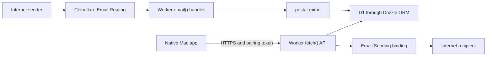
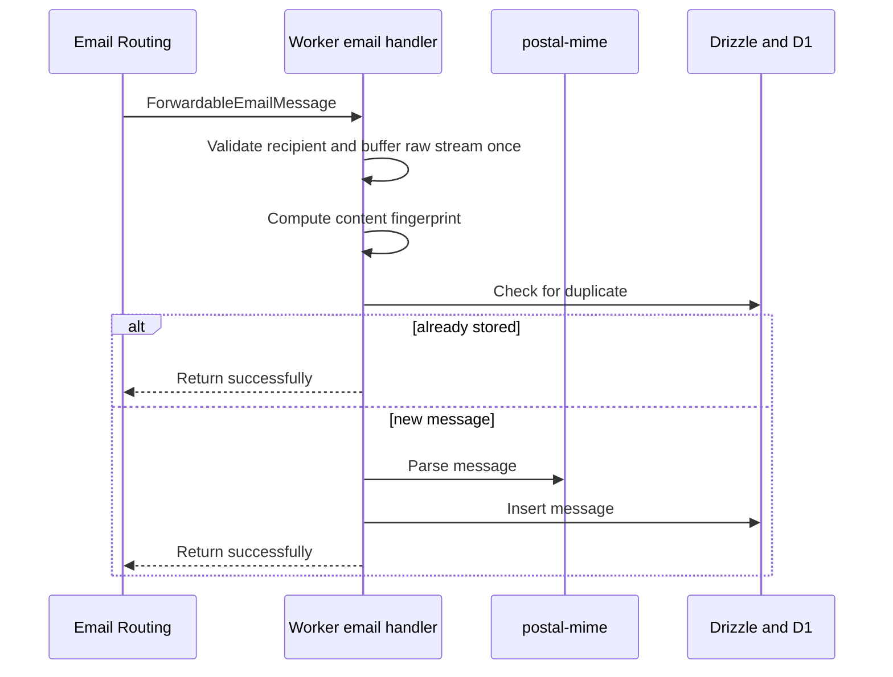
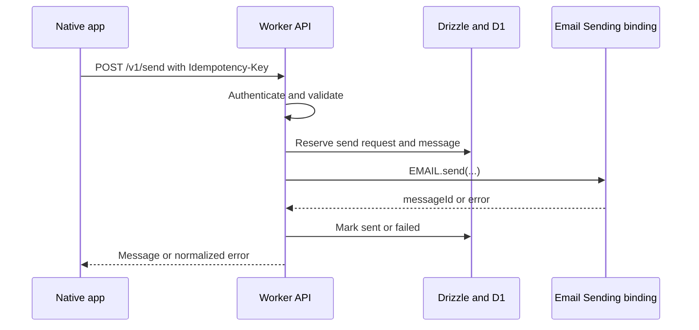

# Cloudflare Mail Worker

## Hackathon technical specification

**Starting point:** Existing plain TypeScript Worker
**Database:** Cloudflare D1 with Drizzle ORM
**Email:** Cloudflare Email Routing and Email Sending
**Scope:** Small single-mailbox experiment
**API version:** `v1`

## 1. Goal

Build a small, user-owned backend for a native Mac email client.

The Worker receives email through Cloudflare Email Routing, parses the useful message fields, saves them in D1, exposes them through a private JSON API, and sends new messages or replies through Cloudflare Email Sending.

The native app never stores a Cloudflare API token. It connects to the Worker using a random pairing token generated by the app.

## 2. Exact v1 scope

The Worker supports:

- One mailbox address per Worker deployment.
- Inbox and Sent message lists.
- Plain-text and HTML message bodies.
- Message detail.
- Read and unread state.
- Sending a new email.
- Replying to an existing email.
- Basic email threading through standard headers.
- Cursor-based list pagination.
- A Deploy to Cloudflare setup flow.

Everything else is outside this experiment.

## 3. Architecture



### 3.1 Worker bindings and configuration

| Name                   | Type                  | Purpose                                      |
| ---------------------- | --------------------- | -------------------------------------------- |
| `DB`                   | D1 binding            | Stores messages and send idempotency records |
| `EMAIL`                | Email Sending binding | Sends new messages and replies               |
| `APP_TOKEN`            | Worker secret         | Authenticates the native app                 |
| `MAILBOX_ADDRESS`      | Worker variable       | Mailbox address and enforced outbound sender |
| `MAILBOX_DISPLAY_NAME` | Worker variable       | Outbound sender display name                 |

### 3.2 Packages

Production dependencies:

```text
drizzle-orm
postal-mime
```

Development dependencies:

```text
drizzle-kit
typescript
wrangler
```

## 4. Suggested structure

Add these pieces to the existing TypeScript Worker:

```text
src/
├── index.ts
├── auth.ts
├── db/
│   ├── client.ts
│   └── schema.ts
├── email/
│   ├── receive.ts
│   └── send.ts
└── api/
    ├── router.ts
    └── responses.ts
drizzle/
drizzle.config.ts
wrangler.jsonc
```

This is organizational guidance, not a requirement.

## 5. Drizzle ORM setup

### 5.1 D1 client

Create the Drizzle client from the Worker environment:

```ts
import { drizzle } from "drizzle-orm/d1";

export function createDb(env: Env) {
  return drizzle(env.DB);
}
```

Do not create a global client that captures one request's environment.

### 5.2 Schema and migrations

`src/db/schema.ts` is the source of truth for the database schema.

Use Drizzle Kit to generate SQL migrations and commit them under `drizzle/`. Apply those migrations to D1 with Wrangler during deployment.

Runtime API handlers must not create or modify tables.

All database access must use Drizzle queries or parameterized SQL. Never concatenate request values into SQL.

When two writes must succeed together, such as reserving a send request and creating its outbound message, use Drizzle's D1 batch API. D1 batches execute transactionally and roll back the sequence if one statement fails.

## 6. Authentication

### 6.1 Pairing token

The native app generates 32 cryptographically random bytes, encodes them using unpadded Base64URL, and stores the token in macOS Keychain.

The user pastes the same token into the Deploy to Cloudflare flow as the `APP_TOKEN` Worker secret.

### 6.2 Request authorization

Every `/v1/*` request requires:

```http
Authorization: Bearer <APP_TOKEN>
```

`GET /health` is public.

The Worker must:

- Return `401` for a missing or incorrect token.
- Compare token bytes without an early exit.
- Never accept the token in the URL.
- Never log the token or Authorization header.
- Return `Cache-Control: no-store` on authenticated responses.

### 6.3 Sender enforcement

The sender is always `MAILBOX_ADDRESS`. The send API does not accept a `from` field.

## 7. Database schema

The experiment uses two tables.

### 7.1 `messages`

| Column               | Drizzle type       | Purpose                                               |
| -------------------- | ------------------ | ----------------------------------------------------- |
| `id`                 | `text` primary key | Internal UUID                                         |
| `threadId`           | `text` not null    | Groups replies together                               |
| `direction`          | `text` not null    | `inbound` or `outbound`                               |
| `status`             | `text` not null    | `received`, `sending`, `sent`, `failed`, or `unknown` |
| `rfcMessageId`       | `text`             | Standard email Message-ID                             |
| `inReplyTo`          | `text`             | Standard threading header                             |
| `referencesJson`     | `text` not null    | JSON array of reference IDs                           |
| `fromJson`           | `text` not null    | Parsed sender object                                  |
| `toJson`             | `text` not null    | Parsed recipient array                                |
| `ccJson`             | `text` not null    | Parsed CC array                                       |
| `bccJson`            | `text` not null    | Outbound BCC array                                    |
| `replyToJson`        | `text`             | Parsed Reply-To object                                |
| `subject`            | `text` not null    | Message subject                                       |
| `snippet`            | `text` not null    | Short preview                                         |
| `bodyText`           | `text`             | Plain-text body                                       |
| `bodyHtml`           | `text`             | HTML body                                             |
| `isRead`             | `integer` not null | Boolean read state                                    |
| `sentAt`             | `text`             | UTC ISO timestamp                                     |
| `receivedAt`         | `text`             | UTC ISO timestamp                                     |
| `contentFingerprint` | `text` unique      | Inbound deduplication                                 |
| `providerMessageId`  | `text`             | Email Sending result                                  |
| `createdAt`          | `text` not null    | UTC ISO timestamp                                     |
| `updatedAt`          | `text` not null    | UTC ISO timestamp                                     |

Required indexes:

- `messages(direction, receivedAt, sentAt)`
- `messages(threadId, receivedAt, sentAt)`
- `messages(updatedAt, id)`
- `messages(rfcMessageId)`
- Unique index on `contentFingerprint`

### 7.2 `sendRequests`

| Column           | Drizzle type       | Purpose                                                |
| ---------------- | ------------------ | ------------------------------------------------------ |
| `idempotencyKey` | `text` primary key | Client-generated request UUID                          |
| `payloadHash`    | `text` not null    | Detects reuse with different content                   |
| `messageId`      | `text` not null    | Associated outbound message                            |
| `status`         | `text` not null    | `preparing`, `sending`, `sent`, `failed`, or `unknown` |
| `errorCode`      | `text`             | Sanitized error code                                   |
| `createdAt`      | `text` not null    | UTC ISO timestamp                                      |
| `updatedAt`      | `text` not null    | UTC ISO timestamp                                      |

## 8. Inbound email flow



The exported Worker implements `email(message, env, ctx)`.

For each inbound email:

1. Normalize `message.to` and require it to match `MAILBOX_ADDRESS`.
2. Reject any other recipient with `message.setReject()`.
3. Buffer `message.raw` exactly once using `new Response(message.raw).arrayBuffer()`.
4. Compute `SHA-256(normalized recipient + NUL + raw bytes)`.
5. Check `contentFingerprint` for an existing message.
6. If it already exists, return successfully.
7. Parse the buffered email with `postal-mime`.
8. Extract sender, recipients, Reply-To, subject, date, Message-ID, In-Reply-To, References, text, and HTML.
9. Resolve the thread ID.
10. Generate a short snippet from text, falling back to stripped HTML.
11. Insert the message as `inbound`, `received`, and unread.
12. Return after the D1 insert succeeds.

The raw stream is discarded when the handler finishes.

### 8.1 Thread resolution

Resolve the thread in this order:

1. Match `In-Reply-To` to an existing `rfcMessageId` and reuse its `threadId`.
2. Walk `References` newest-to-oldest and reuse the first matching thread.
3. Otherwise create a new thread UUID.

Do not merge messages by subject in v1.

### 8.2 Parsing failure

If parsing fails, store a minimal message with envelope values, safe values from `message.headers`, empty bodies, and the snippet `(Unable to parse message)`.

Do not log the raw email.

## 9. Outbound email flow



For each send request:

1. Authenticate the app.
2. Require an `Idempotency-Key` UUID header.
3. Validate recipients, subject, and body.
4. Force the sender to the configured mailbox.
5. Hash the normalized payload.
6. Reserve the idempotency key and create the outbound message before sending.
7. Call `env.EMAIL.send()` using the structured binding.
8. Add `In-Reply-To` and `References` when replying.
9. On success, mark the message `sent` and save the provider message ID.
10. On a definitive error, mark it `failed`.
11. If execution may have stopped after sending began, preserve `unknown` and do not retry automatically.

### 9.1 Idempotency

When the same key appears again:

- Same payload and `sent`: return the existing message.
- Same payload and still running: return `409 SEND_IN_PROGRESS`.
- Same payload and `unknown`: return `409 SEND_STATUS_UNKNOWN`.
- Different payload: return `409 IDEMPOTENCY_CONFLICT`.

## 10. API conventions

Base URL:

```text
https://<deployment>.workers.dev/v1
```

All API bodies use JSON.

Success:

```json
{
  "data": {},
  "meta": {
    "requestId": "..."
  }
}
```

Error:

```json
{
  "error": {
    "code": "MESSAGE_NOT_FOUND",
    "message": "The requested message does not exist.",
    "requestId": "..."
  }
}
```

Do not expose SQL, stack traces, secrets, binding details, or raw provider errors.

## 11. Endpoints

| Method  | Path                | Auth | Purpose                                   |
| ------- | ------------------- | ---- | ----------------------------------------- |
| `GET`   | `/health`           | No   | Liveness only                             |
| `GET`   | `/v1/status`        | Yes  | Verify the Worker URL, token, and mailbox |
| `GET`   | `/v1/messages`      | Yes  | List Inbox or Sent messages               |
| `GET`   | `/v1/messages/{id}` | Yes  | Read one message                          |
| `PATCH` | `/v1/messages/{id}` | Yes  | Mark read or unread                       |
| `POST`  | `/v1/send`          | Yes  | Send a new message or reply               |

### 11.1 `GET /health`

Response:

```json
{
  "status": "ok",
  "service": "cloudflare-mail-worker"
}
```

Do not access D1 or reveal mailbox configuration.

### 11.2 `GET /v1/status`

Response:

```json
{
  "data": {
    "service": "cloudflare-mail-worker",
    "apiVersion": 1,
    "mailbox": {
      "address": "hello@example.com",
      "displayName": "Fayaz"
    },
    "serverTime": "2026-07-21T10:00:00.000Z"
  },
  "meta": {
    "requestId": "..."
  }
}
```

The Mac app calls this after the user pastes the Worker URL.

### 11.3 `GET /v1/messages`

Query parameters:

- `folder`: required, `inbox` or `sent`.
- `cursor`: optional opaque cursor.
- `limit`: optional, default `50`.

Inbox maps to `direction = inbound`. Sent maps to `direction = outbound` and `status = sent`.

Return newest messages first. The cursor represents the last message timestamp and ID from the previous page.

List items include message metadata and snippet, but not `bodyText` or `bodyHtml`.

Response:

```json
{
  "data": {
    "messages": [
      {
        "id": "019...",
        "threadId": "019...",
        "direction": "inbound",
        "status": "received",
        "from": {
          "address": "person@example.net",
          "name": "Person"
        },
        "subject": "Hello",
        "snippet": "Just checking in...",
        "isRead": false,
        "receivedAt": "2026-07-21T09:59:00.000Z"
      }
    ],
    "nextCursor": null
  },
  "meta": {
    "requestId": "..."
  }
}
```

### 11.4 `GET /v1/messages/{id}`

Response:

```json
{
  "data": {
    "id": "019...",
    "threadId": "019...",
    "direction": "inbound",
    "status": "received",
    "from": {
      "address": "person@example.net",
      "name": "Person"
    },
    "to": [
      {
        "address": "hello@example.com",
        "name": null
      }
    ],
    "cc": [],
    "subject": "Hello",
    "bodyText": "Plain text body",
    "bodyHtml": "<p>HTML body</p>",
    "isRead": false,
    "receivedAt": "2026-07-21T09:59:00.000Z",
    "sentAt": null
  },
  "meta": {
    "requestId": "..."
  }
}
```

Return `404 MESSAGE_NOT_FOUND` for an unknown ID.

### 11.5 `PATCH /v1/messages/{id}`

Request:

```json
{
  "isRead": true
}
```

Only `isRead` is accepted. Return the updated message summary.

### 11.6 `POST /v1/send`

Headers:

```http
Authorization: Bearer <token>
Idempotency-Key: <UUID>
Content-Type: application/json
```

New message:

```json
{
  "to": [
    {
      "address": "person@example.net",
      "name": "Person"
    }
  ],
  "cc": [],
  "bcc": [],
  "subject": "Hello",
  "text": "Plain text body",
  "html": "<p>HTML body</p>"
}
```

Reply:

```json
{
  "replyToMessageId": "019...",
  "to": [
    {
      "address": "person@example.net",
      "name": "Person"
    }
  ],
  "cc": [],
  "bcc": [],
  "subject": "Re: Hello",
  "text": "Thanks for the note.",
  "html": "<p>Thanks for the note.</p>"
}
```

At least one recipient and one body representation are required. The Worker adds the configured sender and any reply-threading headers.

Response `201`:

```json
{
  "data": {
    "message": {
      "id": "019...",
      "threadId": "019...",
      "direction": "outbound",
      "status": "sent",
      "subject": "Hello",
      "providerMessageId": "...",
      "sentAt": "2026-07-21T10:00:00.000Z"
    }
  },
  "meta": {
    "requestId": "..."
  }
}
```

## 12. Error codes

| HTTP  | Code                   | Meaning                          |
| ----- | ---------------------- | -------------------------------- |
| `400` | `INVALID_REQUEST`      | Malformed request                |
| `401` | `AUTH_REQUIRED`        | Token missing                    |
| `401` | `AUTH_INVALID`         | Token incorrect                  |
| `404` | `MESSAGE_NOT_FOUND`    | Message does not exist           |
| `409` | `SEND_IN_PROGRESS`     | Matching send is still running   |
| `409` | `SEND_STATUS_UNKNOWN`  | Matching send may have completed |
| `409` | `IDEMPOTENCY_CONFLICT` | Key reused with another payload  |
| `422` | `VALIDATION_FAILED`    | Invalid recipients or content    |
| `502` | `EMAIL_SEND_FAILED`    | Email Sending returned an error  |
| `503` | `DATABASE_UNAVAILABLE` | D1 operation failed              |
| `500` | `INTERNAL_ERROR`       | Unexpected sanitized failure     |

## 13. Deployment flow

1. The native app generates and displays the pairing token.
2. The user clicks **Deploy to Cloudflare** from the app.
3. The deploy form asks for:
   - `APP_TOKEN`
   - `MAILBOX_ADDRESS`
   - `MAILBOX_DISPLAY_NAME`
4. Deployment provisions D1 and configures the Email Sending binding.
5. The committed Drizzle migration is applied.
6. The user enables Email Routing for the domain.
7. The user creates a routing rule that sends the mailbox address to this Worker.
8. The user pastes the deployed Worker URL into the app.
9. The app calls `/v1/status` with the pairing token.
10. A successful response completes connection.

## 14. Logging and privacy

Never log:

- The pairing token.
- Authorization headers.
- Email subjects or bodies.
- Full sender or recipient addresses.
- Raw email content.

Logs may include request ID, internal message ID, operation, duration, and normalized error code.

The Worker must not fetch remote URLs found inside HTML email.

## 15. Tests

Required tests:

- Pairing-token authentication.
- Drizzle migration against test D1.
- Plain-text inbound parsing.
- HTML inbound parsing.
- Inbound fingerprint deduplication.
- Thread resolution using `In-Reply-To` and `References`.
- Inbox and Sent pagination.
- Read/unread mutation.
- Successful new send with a mocked Email binding.
- Successful threaded reply.
- Idempotency-key reuse.
- Email Sending error mapping.
- Unauthorized access to every private endpoint.

## 16. Acceptance criteria

The experiment is complete when:

- The existing TypeScript Worker uses Drizzle for D1 access.
- A committed Drizzle migration creates both tables and indexes.
- The Worker receives routed plain-text and HTML email.
- Received messages appear in the Inbox API.
- The message-detail API returns stored content.
- The API can mark a message read or unread.
- The Worker sends a new email through the Email Sending binding.
- The Worker sends a reply with threading headers.
- Sent messages appear in the Sent API.
- Duplicate inbound deliveries create one row.
- Reusing an idempotency key does not intentionally send twice.
- The Mac app connects using only the Worker URL and pairing token.

## 17. Implementation order

1. Add Drizzle ORM, Drizzle Kit, and `postal-mime`.
2. Add the D1 binding.
3. Define `messages` and `sendRequests` in `src/db/schema.ts`.
4. Generate and apply the initial migration.
5. Add authentication and JSON response helpers.
6. Implement `/health` and `/v1/status`.
7. Implement the `email()` handler.
8. Implement Inbox, Sent, message detail, and read state.
9. Implement new send and reply.
10. Add tests and Deploy to Cloudflare configuration.

## 18. References

- [Cloudflare Email Routing Workers API](https://developers.cloudflare.com/email-service/api/route-emails/email-handler/)
- [Cloudflare Email Sending Workers API](https://developers.cloudflare.com/email-service/api/send-emails/workers-api/)
- [Email Sending binding configuration](https://developers.cloudflare.com/email-service/configuration/send-bindings/)
- [Email Routing rules](https://developers.cloudflare.com/email-service/configuration/email-routing-addresses/)
- [Deploy to Cloudflare buttons](https://developers.cloudflare.com/workers/platform/deploy-buttons/)
- [D1 migrations](https://developers.cloudflare.com/d1/reference/migrations/)
